# HealthAIoT Progress Report

This report gathers the model, scheduler, latency, and resource graphs generated in this workspace.

## Current Temporal Run

- Source file: `../temporal_stats.json`
- Time window: `2026-05-06 22:55:27` to `2026-05-06 22:55:41`
- Requests logged: 140
- Routing: worker_1=140
- Average latency: 0.588 ms; median 0.084 ms; p95 3.564 ms; max 9.892 ms
- Average model execution: 1.306 ms
- Average total execution time: 1946.46 ms; p95 2296.29 ms

### Temporal Summary by System

| System | Requests | Avg latency (ms) | Median latency (ms) | P95 latency (ms) | Max latency (ms) | Avg total (ms) |
| --- | ---: | ---: | ---: | ---: | ---: | ---: |
| worker_1 | 140 | 0.588 | 0.084 | 3.564 | 9.892 | 1946.46 |

## Temporal Latency Graph

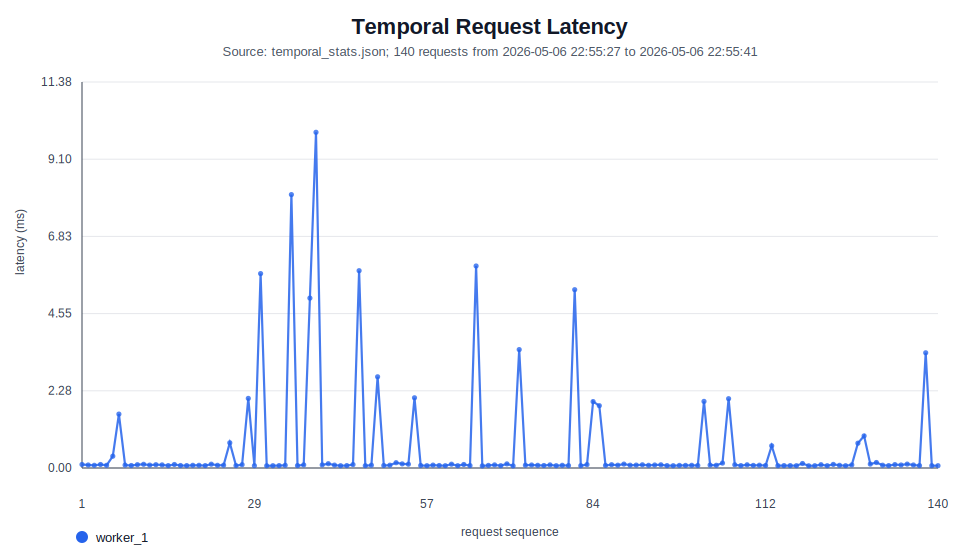

## Disease Model Graphs

### Confusion Matrix With Percentages

### SHAP Swarm Plot

### Dataset Correlation Matrix

### SMOTE Preprocessing Comparison

## Scheduler and Latency Graphs

### Cloud Scheduler Training Progress

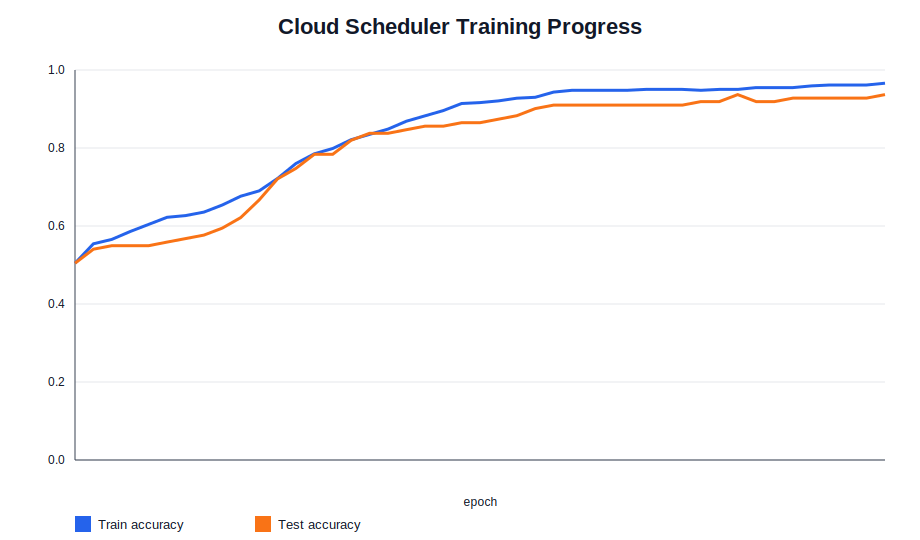

### Latency Summary

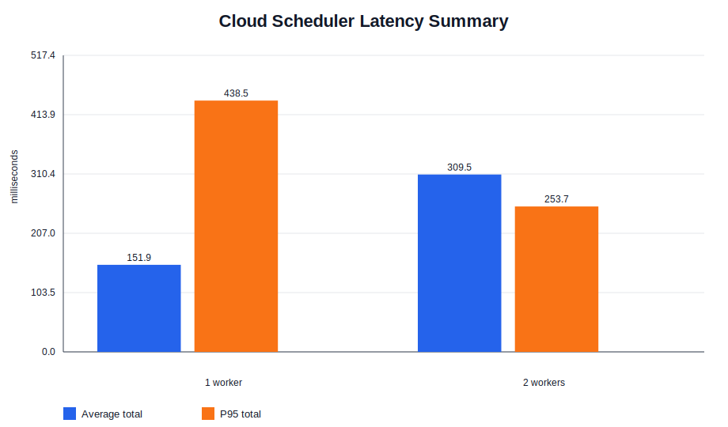

### Latency Distribution

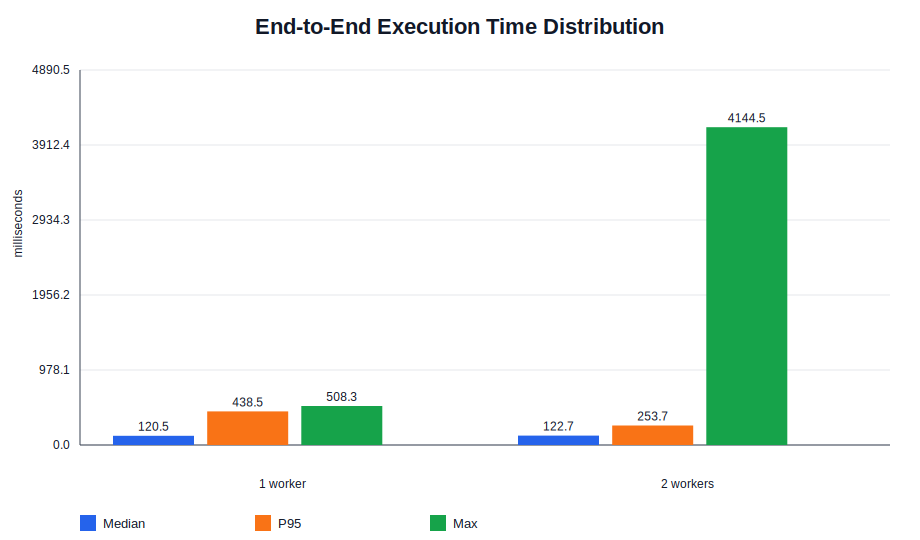

### End-to-End Time Breakdown

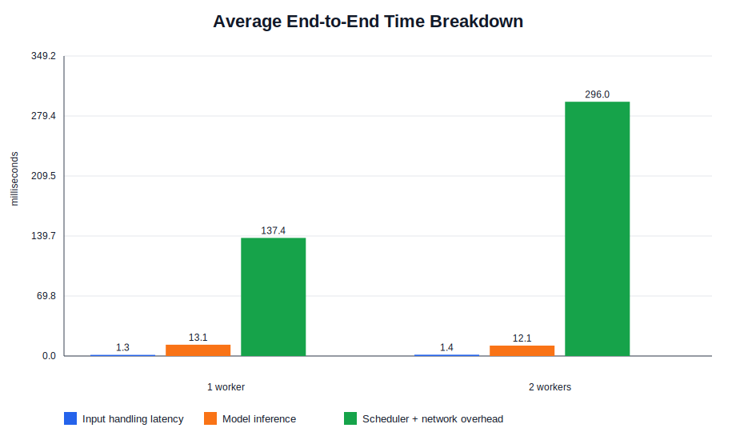

### Request Routing

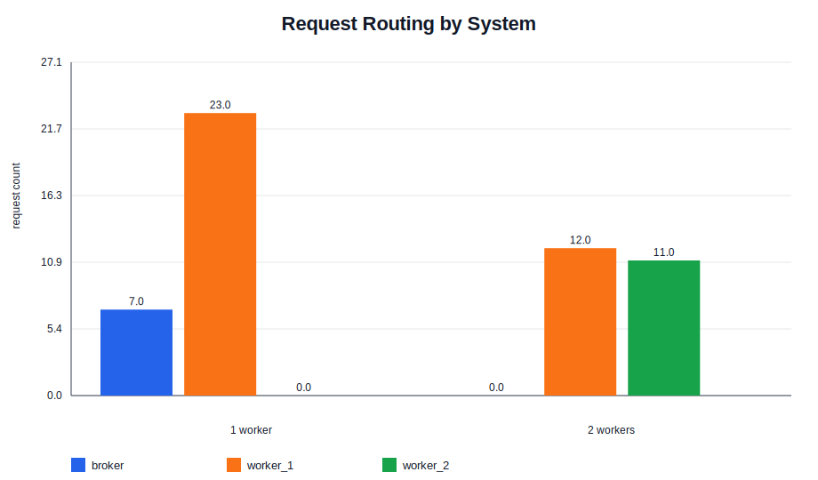

## Resource Graphs

### Average Resource Utilization

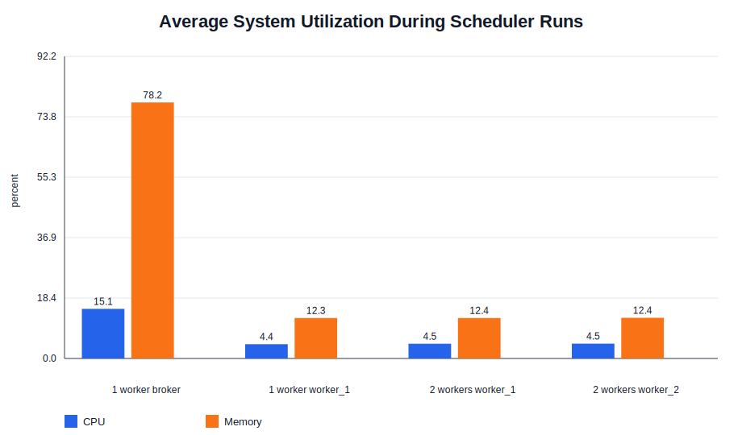

### 2-Worker CPU Time Series

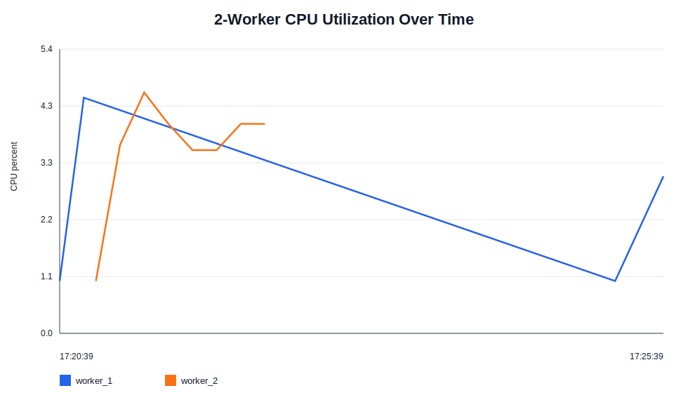

### 2-Worker Memory Time Series

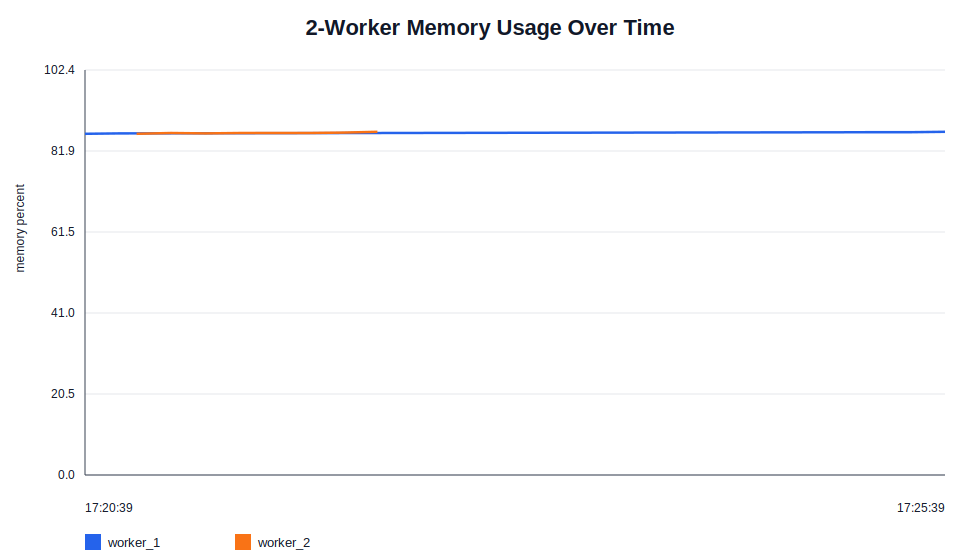

### 2-Worker Network Time Series

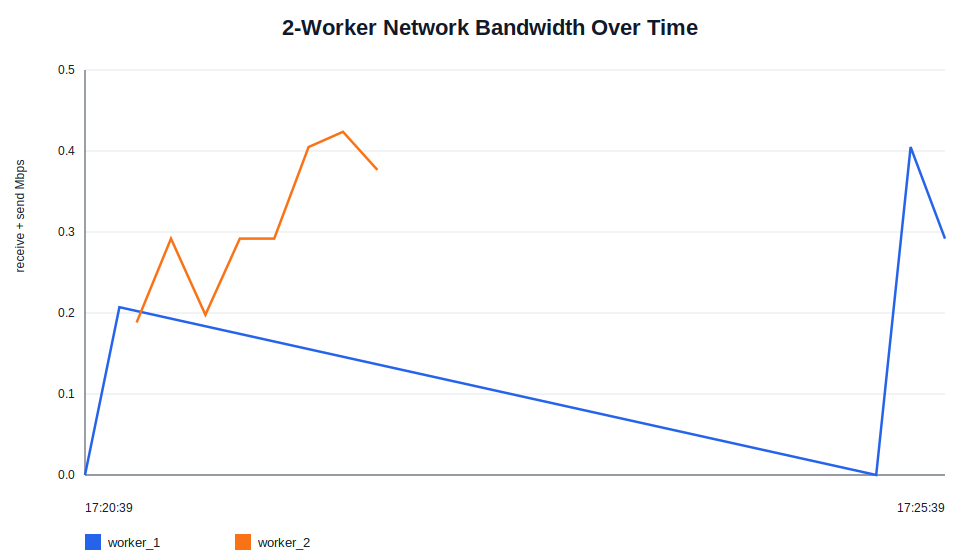

### 2-Worker Selection Counts

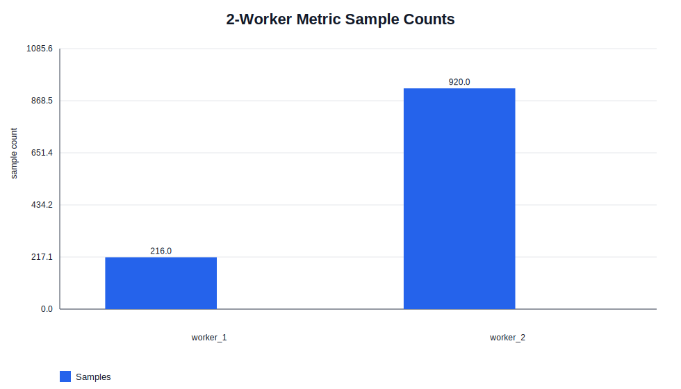

### Resource Utilization Comparison

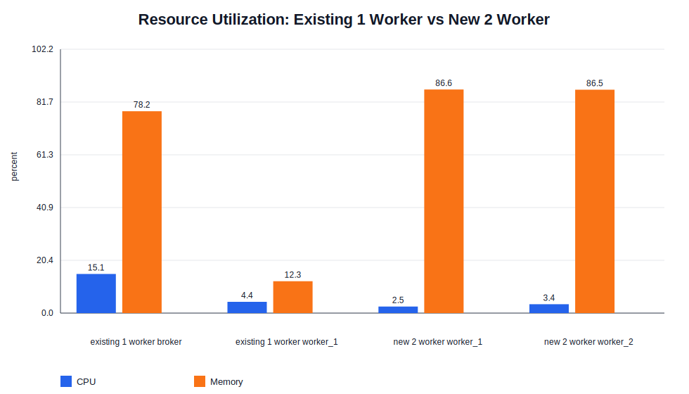

### Network Comparison

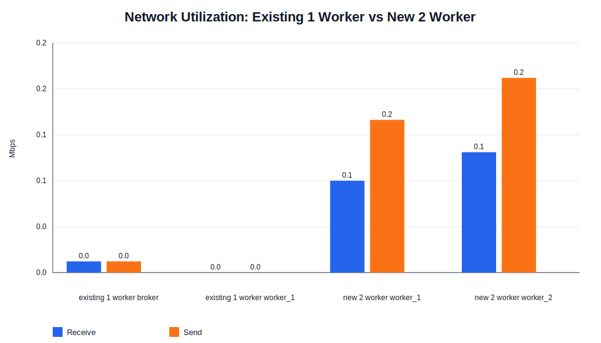

## Generated Files

- `current_temporal_latency.svg`: latency plot generated from `../temporal_stats.json`.
- `current_temporal_summary.csv`: per-system temporal summary for the current run.
- `PROGRESS_REPORT.md`: this progress report.
